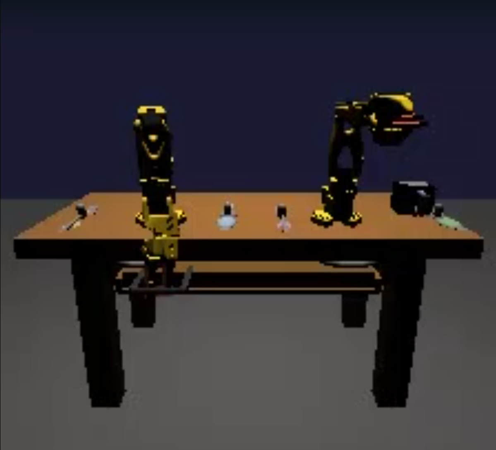

# Bi-Manual VLA

**Two SO-101 arms learn to clear and set a dinner table. Simulated contact physics
generates the demonstrations; a Vision-Language-Action policy learns from them and is
deployed to Intel hardware.**

Two SO-101 arms open a drawer, retrieve cutlery, pick up two plates and a mug, and place
every object in its target zone — upright, separated, and supported by the table.
Demonstrations are recorded into a [LeRobot v3](https://github.com/huggingface/lerobot)
dataset and used to fine-tune [SmolVLA](https://huggingface.co/blog/smolvla).

**The grasping is physical.** The jaws are position servos that drive into an object and
stall against it; the resulting contact force is the grip. There is no weld constraint, no
equality attachment, no object-follow, and no pose teleport anywhere in the transport
path. Objects carry real mass, inertia and gravity — if friction is insufficient, the
object falls and the episode is rejected.



*The arena from the front. Both arms, the tabletop, the tableware and the pull drawer are
one MuJoCo scene — the same scene the camera streams are rendered from.*

---

## Hardware

Training and deployment target deliberately different hardware. Train where the bandwidth
is; deploy where the power budget is.

| Role | Platform | Specification |
| --- | --- | --- |
| **Training** | NVIDIA RTX PRO 6000 Blackwell (Molab) | 96 GB GDDR7, CUDA, BF16 mixed precision |
| **Deployment target** | Intel Core Ultra 7 265T — Arrow Lake, bare metal | 20 cores · 32 GiB DDR5-5600 · 512 GiB · Windows 11 |
| **Execution units** | Intel Core Ultra | CPU · integrated GPU · NPU |

All three Intel execution units are exposed to the OpenVINO runtime:

```json
{"available_devices": ["CPU", "GPU", "NPU"]}
```

### Why the rendering backend is split

| Stage | Runs on | Why |
| --- | --- | --- |
| Contact physics | CPU MuJoCo | The grasp needs `noslip` contact iterations; MJWarp does not implement them |
| Image rendering | GPU via MuJoCo Warp | Ray-traced batch rendering — **no EGL, no OpenGL** |

Container runtimes that expose a CUDA GPU but no working GPU OpenGL — which is most of
them, including Molab — cannot use the standard `MUJOCO_GL=egl` path. MuJoCo Warp renders
through CUDA instead, so the pipeline runs unchanged where an OpenGL-based collector would
fall back to a CPU rasteriser. See [`docs/TROUBLESHOOTING.md`](docs/TROUBLESHOOTING.md).

---

## Status

| Component | State |
| --- | --- |
| Bimanual MuJoCo environment | Working — contact-only grasping, four cameras |
| Demonstration generator (`scripts/task_demo.py`) | Physics validated — 7 of 10 seeds diverge; stability work in progress |
| Molab GPU collector (`scripts/record_molab_mjwarp.py`) | Working — 10 parallel workers, 320×320, AV1 |
| Kaggle CPU collector (`scripts/record_lerobot_shard.py`) | Working — 4-worker sharded fallback |
| Merge + validation (`scripts/merge_molab_episodes.py`) | Working |
| Dataset | **71 episodes · 218,384 frames · 25 Hz** |
| SmolVLA fine-tune | **4,000 / 6,826 steps (58.6%)** — checkpoint loads and runs |
| Intel inference | **Working** — policy emits a valid 12-D action |
| OpenVINO IR conversion | Not started — device detection only |
| CPU / GPU / NPU benchmark sweep | Harness ready, measurements pending |
| Policy evaluation | Not started |

All figures above are read from recorded artifacts. **No policy success rate is claimed,
because none has been measured yet.** See [`docs/RESULTS.md`](docs/RESULTS.md) for the
full results and what each number is measured against.

---

## Dataset

LeRobot v3, 25 Hz, four synchronized camera streams.

| Key | Shape | View |
| --- | --- | --- |
| `observation.images.front` | 320×320×3 | front |
| `observation.images.arm_a` | 320×320×3 | left wrist |
| `observation.images.arm_b` | 320×320×3 | right wrist |
| `observation.images.top` | 320×320×3 | top-down |
| `observation.state` | (12,) | 6 joints × 2 arms |
| `action` | (12,) | normalized joint position targets |

Videos are AV1 (`libsvtav1`), CRF 18, keyframe interval 25 — one per second. CRF 30 was
tried first and visibly softened thin objects; forks and spoons lost the edges the grasp
depends on.

**71 successful episodes, 218,384 frames.** Each was accepted only after passing physical
success checks: measured object lift, drawer travel, tabletop support, zone containment,
upright mug, and separated plates.

Schema, normalization, and the fine-tune recipe: [`docs/DATASET.md`](docs/DATASET.md).

---

## Benchmarking

The policy is characterised across all three Intel execution units — CPU, integrated GPU,
and NPU — and **energy is reported alongside latency**. Throughput alone misleads on a
power-constrained part: the fastest device is not always the one that can be sustained.

| Metric | Why it is reported |
| --- | --- |
| Throughput (inferences/s) | Raw wall-clock capability |
| Mean latency (ms/action) | Against the **40 ms** real-time control budget |
| Package power (W) | Sustained draw over the timed loop |
| Energy per inference (mJ) | Power × latency — the cost of one decision |
| Efficiency (inferences/s/W) | Decides the deployment target |

The environment runs at 25 Hz, so a policy inference must complete inside **40 ms** to
drive the robot in real time. Every device is measured against that threshold.

**Power is measured from a counter, not a datasheet.** The harness samples an Intel
package energy counter around the same timed loop as the latency. Where the host exposes
no such counter — as on the Windows target — it records the field as `null` and prints
`power: not measured`, rather than filling the column from a TDP.

Measurements are in progress. Run the sweep on the target, then on the ten-seed
generator sweep:

```bash
python benchmark_intel_devices.py --checkpoint <pretrained_model> --iters 20
python scripts/evaluate_10_seeds.py            # one process per seed
```

Current status and the table structure:
[`docs/RESULTS.md`](docs/RESULTS.md#benchmarking--cpu--gpu--npu).

---

## Repository layout

```
Bi-Manual_VLA/
├── notebooks/
│   └── 01_environment_cells.py    marimo cells 1–13; cells 2–7 build the scene
├── scripts/
│   ├── task_demo.py               demonstration generator — the physics authority
│   ├── record_molab_mjwarp.py     GPU collector: CPU physics + Warp rendering
│   ├── record_lerobot_shard.py    CPU collector: sharded fallback
│   ├── merge_molab_episodes.py    episode checkpoints → one LeRobot v3 dataset
│   ├── evaluate_10_seeds.py       ten-seed sweep; aggregates per-seed success
│   ├── run_intel_inference.py     load the checkpoint on the Intel target
│   ├── smolvla_policy_adapter.py  SmolVLA → 4-camera, 12-D interface
│   ├── export_smolvla_openvino.py export the policy to OpenVINO IR
│   └── benchmark_intel_openvino.py per-device IR latency
├── benchmark_intel_devices.py     CPU / GPU / NPU sweep for the Intel target
├── assets/meshes/                 tableware; coacd/ holds collision decompositions
├── third_party/SO-ARM100/         vendored SO-101 model (Apache-2.0)
├── docs/                          results, architecture, dataset schema, reproduction
└── tests/                         structural checks and smoke tests
```

**`notebooks/01_environment_cells.py` is not documentation.** `task_demo.py` reads it at
import time, `exec`s cells 2–7, and pulls `cfg`, `build_arena` and `lookat_xyaxes` out of
the resulting namespace. Editing those cells changes the physics.

---

## Quickstart

Requires Python 3.10–3.12 and a working MuJoCo. **No GPU is needed for the environment.**

```bash
git clone https://github.com/mudgalKrishna/Bi-Manual_VLA.git
cd Bi-Manual_VLA
python -m venv .venv && . .venv/bin/activate     # Windows: .venv\Scripts\activate
pip install -r requirements.txt
python tests/test_repo_structure.py              # structure check, runs anywhere
```

Reproduce the reference rollout — one episode, no rendering, no randomization:

```bash
python scripts/task_demo.py
```

If that completes and reports success, the physics half of the pipeline is working. To
confirm the GPU render path before committing to a long collection run:

```bash
python scripts/record_molab_mjwarp.py \
    --output-root /tmp/v21-pilot \
    --episode-start 0 --episodes 1 --physics-workers 1
```

Then inspect the episode directory — it must contain four camera streams, and **the arms
and the camera views must both move**. A static camera across all frames is the failure
mode that produces a dataset which trains but does not learn.

Full instructions, including the 10-worker fan-out and the CPU path:
[`docs/REPRODUCE.md`](docs/REPRODUCE.md).

---

## Design notes

**Rejected episodes are kept, not deleted.** A rollout that fails the success check is
written to `manifest.json` under `rejected` with `"accepted_for_training": false`. The
training set contains only accepted episodes, but the rejection rate stays visible and
auditable.

**Every episode is an atomic checkpoint.** Each accepted rollout is finalised as its own
single-episode LeRobot dataset, uploaded immediately, and merged only at the end. A
crashed or preempted worker loses at most one episode, and parallel workers never touch
shared metadata.

**Rendering is not physics.** The Warp renderer calls `fwd_kinematics`, not `forward` — it
needs transforms, not collision detection. Contact behaviour comes exclusively from the
CPU MuJoCo solve in `task_demo.py`.

**Success is measured, not asserted.** A grasp is accepted only when the object's measured
centre rises by 20–25 mm or more after the lift. A jaw that closes on air is rejected.

---

## Licensing and attribution

Original code and assets: [MIT](LICENSE).

The vendored SO-101 robot model under `third_party/SO-ARM100/` is **Apache-2.0** from
[TheRobotStudio/SO-ARM100](https://github.com/TheRobotStudio/SO-ARM100) and is not covered
by the MIT license. See [`third_party/NOTICE.md`](third_party/NOTICE.md).

Third-party Python dependencies (MuJoCo, MuJoCo Warp, dm_control, LeRobot, OpenVINO)
retain their own licenses.
